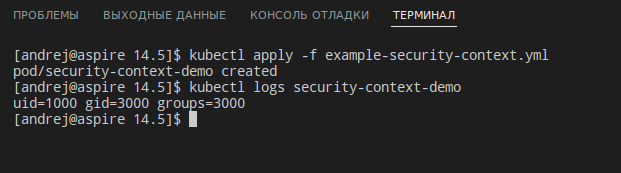
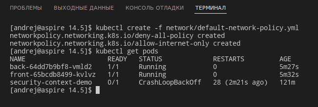

# Домашнее задание к занятию "14.5 SecurityContext, NetworkPolicies"

## Задача 1: Рассмотрите пример 14.5/example-security-context.yml

Создайте модуль

```
kubectl apply -f 14.5/example-security-context.yml
```

Проверьте установленные настройки внутри контейнера

```
kubectl logs security-context-demo
uid=1000 gid=3000 groups=3000
```
---

## Ответ:



## Задача 2 (*): Рассмотрите пример 14.5/example-network-policy.yml

Создайте два модуля. Для первого модуля разрешите доступ к внешнему миру
и ко второму контейнеру. Для второго модуля разрешите связь только с
первым контейнером. Проверьте корректность настроек.

---
## Ответ:

Создал политики с таким содержанием:
```yml
---
#Сначала запретим всё.
kind: NetworkPolicy
apiVersion: networking.k8s.io/v1
metadata:
  name: deny-all-policy
  namespace: kuber-14-5
spec:
  podSelector: {}
  ingress: []   
  egress: [] 

---
#Теперь разрешим траффик приложению front. И входящий, и исходящий.
kind: NetworkPolicy
apiVersion: networking.k8s.io/v1
metadata:
  name: allow-internet-only
spec:
  podSelector:
    matchLabels:
      app: front
  policyTypes:
  - Egress
  - Ingress
  egress:
  - to:
    - ipBlock:
        cidr: 0.0.0.0/0  #Можно во все сети, при этом траффик будет ходить и между подами
  - to:      #Это чтобы DNS работал, а то первая политика всё запрещает.      
    ports:            
    - protocol: UDP   
      port: 53        
  ingress:
  - from:
    - ipBlock:
        cidr: 0.0.0.0/0  #Разрешим и входящий траффик тоже
  - ports:
    - port: 80
    - port: 443
```

